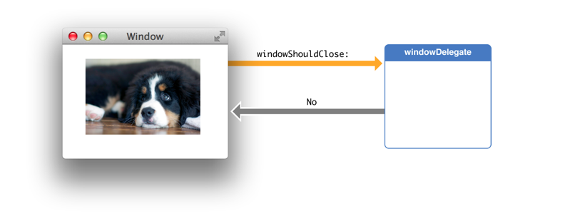
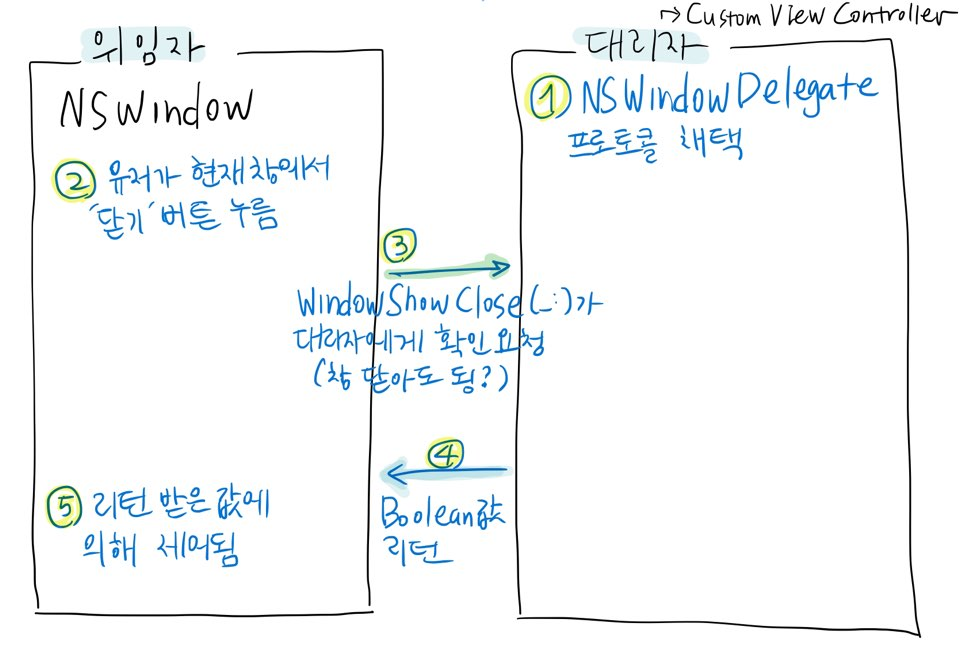

# Delegate vs Closure Callbacks 

## Delegate callback pattern

### What is delegate pattern?

프로그램 안에서 어떤 객체를 대신하여 행동한다던가, 다른 객체와 협동하여 일할 수 있게끔 권한을 위임하는 패턴입니다.

iOS에서 자주사용하는 delegator인 **UITableViewDelegate나 UICollectionViewDelegate의 타입은 프로토콜입니다.**

즉 위임받는 대리자(주로 사용자가 만든 컨트롤러 객체)가, 위임 받으려는 프로토콜을 채택하는 방식으로 위임의 과정이 이루어집니다.

### How works it?

이 패턴에는 크게 두가지 역할이 존재합니다.

* 위임자
  * 위임자는 일반적으로 framework object이다.
  * 대리자에 대한 **참조를 유지**한다.
  * 적절한 시점에 대리자에게 메시지를 보낸다.(* 메시지 - 위임자가 다뤄왔거나, 방금 처리한 이벤트에 대한 알림)
  * 대부분의 Cocoa framework 클래스의 위임자는 대리자에 의해 발생되는 알림의 관찰자로 자동으로 등록된다.
  * 경우에 따라 위임자는 이벤트 처리 방법에 영향을 주는 값을 리턴할 수 있다.
* 대리자
  * 일반적으로 사용자가 만든 컨트롤러 객체이다.
  * 대리자는 특정 알림 메시지를 받기 위해 프레임워크 클래스에서 선언한 (채택한 프로토콜의 메서드만) 구현하면 됩니다.
  * 대리자는 어플리케이션 안에 있는 다른 객체나 자신의 모양이나 상태를 업데이트 해 메시지에 응답한다.

여기서 기억해야 할 사항은 **위임자와 대리자가 서로 메시지를 보내고 응답하면서 통신을 한다는 것** 입니다.

[애플 개발자 문서](https://developer.apple.com/library/archive/documentation/General/Conceptual/DevPedia-CocoaCore/Delegation.html#//apple_ref/doc/uid/TP40008195-CH14)에 있는 예제를 한번 알아보겠습니다.



위임자 `NSWidnow` 는 AppKit 프레임워크 클래스의 인스턴스 입니다.

프로그래머가 만들고 있는 custom view controller에서 `NSWindow` 의 일을 위임하는 `NSWindowDelegate` 프로토콜을 채택합니다.

사용자가 왼쪽에 있는 창에서 '닫기' 상자를 클릭하면 `windowShowClose(_:)` 가 대리자에게 확인을 요청합니다.

custom view controller에서는 로직에 따라 Boolean 값을 리턴하고 NSWindow는 리턴받은 값에 의해 제어됩니다.



위의 그림과 같이 위임자는 대리자에게 할 일을 위임해주고 위임 객체에 어떤 변화가 있을 때,

대리자에게 확인 요청을 합니다. 그리고 대리자가 리턴하는 값에 따라 위임 객체의 동작을 제어하게 됩니다.

### Why use it?

```swift
protocol BossDelegate{
    func manageTasks()
}

struct Secretary: BossDelegate{
    func manageTasks() {
        print("오늘 할일이 산더미")
    }
}

struct Assistance: BossDelegate{
    func manageTasks() {
        print("쉬엄 쉬엄")
    }
}

struct Boss{
    var delegate: BossDelegate // #1
}

var boss = Boss(delegate: Secretary()) // #2
boss.delegate = Assistance() // #3

boss.delegate.manageTasks() // 쉬엄 쉬엄

```

위의 코드를 보면 `Secretary` 와 `Assistance` 가 `BossDelegate` 프로토콜을 채택하고 있습니다.

`Secretary` 와 `Assistance` 둘 다 `manageTasks()` 구현하며 해당 프로토콜을 준수하는데, 메소드 내부의 상세 구현은 다릅니다.

`Boss`  에서 `delegate` 타입을 `Secretary` 나 `Assistance` 로 할 수 도있지만, `BossDelegate` 프로토콜로 지정함에 따라(#1) 해당 프로토콜을 채택하는 어떤 구조체(or class 등)도 다 들어올 수 있게 됩니다.

이처럼 델리게이트 패턴을 사용함으로 얻는 이점은, 앞에서 살펴봤듯이 객체가 분리된 방식으로(위임하므로)대리자와 위임자간의 통신이 이루어져서 객체의 소유자의 구체적인 타입을 알 필요가 없습니다.

그래서 재사용 및 유지 관리가 훨씬 쉬운 코드를 작성할 수 잇기 때문에 이 패턴을 사용하는 것 같습니다.

### Delegate callback 구현

위의 Delegate pattern을 바탕으로 Delegate callback을 처리하는 것을 구현하겠습니다.

> 자! 고객이 여러곳에서 사용할수 있는 메시지창을 하나 만들어 달라고 합니다.
> 메시지창에는 버튼이 있고 누르면 뷰컨트롤러는 무슨 버튼을 눌렀는지 체크 해서
> 그 버튼이 이벤트가 발생하면 해야하는 일들을 처리 해야 한다고 합니다.

여기서 뷰컨트롤러가 대리자(대신 처리 해줄 객체)이고 메시지창이 위임자(처리를 하라고 시키는 객체)입니다.

**MessageBox.swift**

```swift
import Foundation
import UIKit

protocol MessageBoxDelegate: class {
    func touchButton()
}

class MessageBox: UIView{
    weak var delegate: MessageBoxDelegate?
    var button: UIButton?
    
    public override init(frame: CGRect){
        super.init(frame: frame)
        
        configure()
    }
    
    
    public required init?(coder: NSCoder) {
        super.init(coder: coder)
        
        configure()
    }
    
    func configure(){
        button = UIButton(type: .system)
        if let btn = button{
            btn.setTitle("SEND", for: .normal)
            btn.sizeToFit()
            btn.frame.origin = CGPoint(x: (self.bounds.width - btn.bounds.width) * 0.5,
                                       y: (self.bounds.height - btn.bounds.height) * 0.5)
            btn.addTarget(self, action: #selector(tapButton), for: .touchUpInside)
        }
    }
    
    
    @objc func tapButton(){
        delegate?.touchButton() // 위임한 곳(현재 ViewController)의 touchButton() 메서드 실행
    }
}
```

프로토콜 프로퍼티는 대신 처리해줄 객체를 저장해둘 프로퍼티 입니다.
저장을 해놔야 막상 일을 시켜야할 때 시켜줄수가 있습니다.

```swift
weak var delegate: MessageBoxDelegate?
```


**ViewController.swift**

```swift
import UIKit

class ViewController: UIViewController {

    var messageBox: MessageBox?
    
    override func viewDidLoad() {
        super.viewDidLoad()
        // Do any additional setup after loading the view.
        
        self.messageBox = MessageBox(frame: CGRect(origin: .zero, size: CGSize(width: 300, height: 200)))
        if let msg = messageBox{
            msg.frame.origin = CGPoint(x: (UIScreen.main.bounds.width - msg.bounds.width) * 0.5,
                                       y: (UIScreen.main.bounds.height - msg.bounds.height) * 0.5)
            
            msg.backgroundColor = .lightGray
            msg.delegate = self // 위임자에게 대리자의 객체를 넘겨준다.
            self.view.addSubview(msg)
        }
    }


}

extension ViewController: MessageBoxDelegate{
    func touchButton() {
        print("touchButton")
    }
}

```

여기서 살펴봐야할 포인트가 있습니다.

어떤 객체가 다른 객체에게 처리해야 할일을 시키려면 대신 처리해야할 객체를 가지고 있어야만 합니다.

```swift
msg.delegate = self
```

> **self를 넣는 이유**
>
> 프로토콜을 상속받고 구현하게 되면 상속받은 프로토콜로 형변환이 가능해집니다.

### 굳이 사용하는 이유

> 그냥 객체에서 처리해야할 내용들을 넘겨줘서 처리하면 되지않나?

전용으로 만든다고 하면 상관없습니다.
하지만 범용적이고 재사용성을 추구한다면 추천할만한 방법이 아닙니다.
예를들어서

>고객이 어디서든 메시지박스를 띄우고 눌렀을때 어떠한 작업을
>처리 할수 있게 해달라고 했는데..
>그 작업을 메시지박스 내에서 일을 처리 해주려고 합니다.
>문제는 메시지박스를 쓰는부분마다 처리해야하는 내용이 다르다면..?

똑같이 생긴 메시지박스를 여러개 만들어서 처리를 해줘야 합니다.
물론 상속을 받아서 처리할 부분만 처리해주면 되지만 클래스가 늘어나느 건 어쩔수가 없습니다.


## Closure callback pattern

먼저 Callback을 사용하여 Async를 구성하고 처리하는 방법에 대해 자세히 알아보겠습니다. 즉, 비동기 작업이 완료되는 시점을 인지하는 Completion Handler 로서의 Callback Closure를 살펴보는 것입니다. 기본적으로 **콜백 클로저란 다른 함수의 인자로 들어간 클로저**를 말합니다.

함수의 인자로 클로저가 들어가면 함수는 자신의 코드 내에서 언제든 자신의 인자인 클로저를 부를 수 있게 됩니다.
이런 구조를 활용하여 함수가 자신의 작업을 모두 완료된 후 클로저를 호출하도록 한다면 Async에서 작업이 완료된 시점을 인식하고 처리할 수 있게 됩니다.

아래는 콜백 클로저의 예시입니다.

```swift
func someFunction(someClosure: () -> ()){
  // some codes...
  someClosure()
}
```

위에서 `someFunction` 함수는 콜백 클로저인 `someClosure` 를 호출할 타이밍을 정할 수 있게 되었습니다. 본 함수의 작업이 진행되는 중이거나 모두 완료되고 난 다음 콜백이 호출되도록 지정할 수 있습니다.
이렇게 콜백 클로저를 통해 Async를 구현하는 것이 가장 일반적인 방식으로서, 멀티스레드 작업을 처리하는 Grand Central Dispatch(GCD)도 콜백을 통해 구현됩니다.

아래의 GCD의 async뒤 중괄호도 Trailing Closure Syntax에 따른 콜백 클로저입니다. 이미지를 가져오는 작업이 끝나면 이미지 뷰에 이미지를 업데이트하도록 하고 있습니다.

```swift
DispatchQueue.global(qos: .userInitiated).async{
  let image = self.loadOrGenerateAnImage()
  
  DispatchQueue.main.async{
    self.imageView.image = image
  }
}
```

다음은 Escaping Closure를 통해 Completion 이벤트를 처리하게끔 하는 코드의 예시입니다.

Completion Handler로서 콜백 클로저를 주는 함수를 정의하는 부분과,
이 함수를 호출하고 콜백 클로저를 작성하는 부분 
이렇게 둘로 나누어 살펴보도록 합니다.

```swift
//탈출할 클로저들을 저장할 Array
var handlers: [() -> ()] = []

//탈출할 콜백 클로저를 가진 본 함수 정의하기
func mainFunction(completionHandler: @escaping () -> ()) -> Int{
  //함수가 수행할 코드들 입력
  handlers.append(completionHandler)
  
  return
}

//본 함수 실행하기
mainFunction{
  //Trailing Closure Syntax로 클로저 안이다.
  //completion Handler로 넣을 코드들 입력
}


//탈출한 클로저를 함수가 끝나고 실행
handlers[0]()
```


##Delegate vs Closure Callbacks 

**Delegate pattern**

```swift
protocol ImageDownloaderDelegate: class{
  func imageDownloader(_ downloader: ImageDownloader, didDownloadImage image: UIImage)
}

class ImageDownloader{
  weak var delegate: ImageDownlaoderDelegate?
  
  func downloadImage(url: URL){
    //비동기 이미지 다운로드 코드, 결과값: theImage
    delegate?.imageDownlaoder(self, didDownloadImage: theImage)
  }
}
```

위의 Delegate 방식을 Closure 방식으로 바꾸면 아래와 같습니다.

**Closure pattern**

```swift
class ImageDownloader{
  var didDownload: ((UIImage?) -> Void)?
  
  func downlaodImage(url: URL){
    //비동기 이미지 다운로드 코드, 결과값: theImage
    didDownlaod?(theImage)
  }
}
```


### Breaking the retain cycle

두 개체가 서로를 참조 할 때마다 그 중하나가 다른 개체에 대한 약한 참조를 유지해야만 합니다.

**Delegate pattern**

```swift
class ImageDownloader{
  weak var delegate: ImageDownloaderDelegate?
  // ... 
}

class IamgeViewer: ImageDownloaderDelegate{
  let downloader: ImageDownloader()
  
  init(url: URL){
    downloader.delegate = self
    downloader.downloadImage(url: URL)
  }
  
  func imageDownloader(_ downloader: ImageDownloader, didDownloadImage image: UIImage){
    // image 출력 ...
  }
}
```

* `ImageDownlaoder` 는 `delegate` 약한 참조를 유지해야합니다.
* 약한/강한 참조 관계는 한 곳에서만 정의해야 합니다.

**Closure pattern**

```swift
class ImageDownloader{
  var didDownload: ((UIImage?) -> Void)?
  // ...
}

class ImageViewer{
  let downloader: ImageDownloader
  
  init(url: URL){
    downloader = ImageDownloader()
    downloader.downloadImage(url: url)
    downloader.didDownload = { [weak self] image in
			// image 출력 ...
    }
  }
}
```

* `ImageViewer` 는 콜백에서 참조 자체가 약한 지 확인 합니다.
* 약한/강한 참조 관계는 모든 콜백에서 올바르게 구현되어야 합니다.
* 개발자 실수로 메모리 누수가 발생하기 쉽습니다.

delegate pattern은 이 경우에서 더욱 효율적인 것을 볼 수 있습니다.
약한 참조 관계는 한번만 정의하면 되며 개발자의 실수로 메모리 누수를 방지할 수 있습니다.

### One to many relationships

클로저 콜백이 자신을 사용할 수 있는지 살펴 보겠습니다.

한 클래스에서 여러 개의 `ImageDownloader` 를 사용해야하는 경우 두 패턴이 어떻게 구현했는지 보겠습니다.

**Delegate pattern**

```swift
class ProfilePage: ImageDownloaderDelegate{
  let profilePhotoDownloader = ImageDownloader()
  let headerPhotoDownloader = ImageDownloader()
  
  init(profilePhotoUrl: URL, headerPhotoUrl: URL){
    profilePhotoDownloader.delegate = self
    profilePhotoDownloader.downloadImage(url: profilePhotoUrl)
    
    headerPhotoDownloader.delegate = self
    headerPhotoDownloader.downloadImage(url: headerPhotoUrl)
  }
  
  func imageDownloader(_ downloader: ImageDownloader, didDownloadImage image: UIImage) {
    if downloader === profilePhotoDownloader {
      // show the profile photo...
    } else if downloader === headerPhotoDownloader {
      // show the header photo...
    }
  }
}
```

각 콜백에서 `ImageDownloader` 인스턴스가 어떤 인스턴스를 호출하는지 확인해야 합니다.
델리게이트 메소드가 많으면 if 문이 많아질 것이고 이는 유지보수에 좋지못합니다.
또한 비슷한 문구의 사용으로 실수할 가능성도 있습니다.

```swift
class ProfilePage {
    let profilePhotoDownloader = ImageDownloader()
    let headerPhotoDownloader = ImageDownloader()
    init(profilePhotoUrl: URL, headerPhotoUrl: URL) {
        profilePhotoDownloader.didDownload  = { [weak self] image in
            // show the profile image
        }
        profilePhotoDownloader.downloadImage(url: profilePhotoUrl)
        headerPhotoDownloader.didDownload  = { [weak self] image in
            // show the header image
        }
        headerPhotoDownloader.downloadImage(url: headerPhotoUrl)
    }
}
```

두 인스턴스의 콜백은 완전히 분리되어 있으므로 혼동될 가능성이 없습니다.

### 확장성

**Delegate pattern**

```swift
protocol ImageDownloaderDelegate: class {
    func imageDownloader(_ downloader: ImageDownloader, didDownloadImage image: UIImage)
    func imageDownloaderDidFail(_ downloader: ImageDownloader)
    func imageDownloaderDidPause(_ downloader: ImageDownloader)
    func imageDownloaderDidResume(_ downloader: ImageDownloader)
}
extension ViewController: ImageDownloaderDelegate {
    func imageDownloader(_ downloader: ImageDownloader, didDownloadImage image: UIImage) {
    }
    func imageDownloaderDidFail(_ downloader: ImageDownloader) {
    }
    func imageDownloaderDidPause(_ downloader: ImageDownloader) {
    }
    func imageDownloaderDidResume(_ downloader: ImageDownloader) {
    }
}
```

* 모든 델리게이트 메소드를 깔끔하게 확장했습니다.
* 작동이 어떻게 되는지 분명하게 되어있습니다.

**Closure pattern**

```swift
class ImageDownloader {
    var didDownload: ((UIImage?) -> Void)?
    var didFail: (() -> ())?
    var didPause: (() -> ())?
    var didResume: (() -> ())?
}
class ViewController: UIViewController {
    let downloader = ImageDownloader()
    override func viewDidLoad() {
        super.viewDidLoad()
        downloader.didDownload = {
            //...
        }
        downloader.didFail = {
            //...
        }
        downloader.didPause = {
            //...
        }
        downloader.didResume = {
            //...
        }
    }
}
```

* 모든 콜백에 대한 설정 코드를 어디에 배치해야하는지 명확하지 않습니다.
* 코드가 지저분합니다.

### Delegate vs Closure

**Delegate**

Delegate 패턴은 강력하지만 반응형 및 이벤트 중심 프로그래밍에서 delegate는 고장을 일으키고 코드의 가독성을 해칩니다.
아래는 간단한 delegate 패턴입니다.

```swift
protocol TodoDelegate: class {
    func completed(todo: Todo)
}

struct Todo {
    var id: Int
    var title: String
    
    var completed: Bool = false {
        didSet {
            // Notify delegate of completion
            guard completed else { return }
            delegate?.completed(todo: self)
        }
    }
    
    weak var delegate : TodoDelegate?
    
    init(_ delegate: TodoDelegate, id: Int, title: String) {
        self.delegate = delegate
        self.id = id
        self.title = title
    }
}

class MyParentController: TodoDelegate {
    lazy var todo1: Todo = {
        return Todo(self, id: 1, title: "Todo item 1")
    }()
    
    lazy var todo2: Todo = {
        return Todo(self, id: 2, title: "Todo item 2")
    }()
    
    lazy var todo3: Todo = {
        return Todo(self, id: 3, title: "Todo item 3")
    }()
    
    func completed(todo: Todo) {
        switch todo.id {
        case 1: print("Do something with todo: \(todo.title)")
        case 2: print("Do another thing with todo: \(todo.title)")
        case 3: print("Do final thing with todo: \(todo.title)")
        default: break
        }
    }
}

let controller = MyParentController()
controller.todo1.completed = true
controller.todo2.completed = true
controller.todo3.completed = true

// Prints the following to the console:
// Do something with todo: Todo item 1
// Do something with todo: Todo item 2
// Do final thing with todo: Todo item 3
```

여기서 `Todo` 는 위임자의 역할을 합니다.
`MyParentController` 는 대리자 입니다.

`MyParentController` 에서 `completed` 메서드는 모든 todo에 대해 동작하기 위해 switch 문을 이용했습니다.
우리가 만약 수백개의 `Todo` 객체를 다룬다면 switch 문도 그만큼 필요할 것입니다.
이외에도 `Todo` 객체와 트리거된 기능이 서로 다른 위치에 있는 것이 이상할 수 있습니다.

**Closure**

이제 위의 델리게이트 패턴을 클로저 기반 패턴으로 변환합니다.
이는 함수형 프로그래밍 패러다임에 더 적합합니다.
델리게이트 함수가 트리거되는 대신 호출자가 `Todo` 객체를 "구독"할 수 있습니다.
구독은 closure를 가져와서 준비가되면 나중에 실행할 수 있도록 대기합니다.

```swift
struct Todo {
    var id: Int
    var title: String
    
    var completed: Bool = false {
        didSet {
            // Notify subscribers of completion
            guard completed else { return }
            handlers.forEach { $0(self) }
        }
    }
    
    // Task queue
    var handlers = [(Todo) -> Void]()
    
    init(id: Int, title: String) {
        self.id = id
        self.title = title
    }
    
    mutating func subscribe(completion: @escaping (Todo) -> Void) {
        handlers += [completion]
    }
}

class MyParentController {
    lazy var todo1: Todo = {
        return Todo(id: 1, title: "Todo item 1")
    }()
    
    lazy var todo2: Todo = {
        return Todo(id: 2, title: "Todo item 2")
    }()
    
    lazy var todo3: Todo = {
        return Todo(id: 3, title: "Todo item 3")
    }()
}

let controller = MyParentController()

controller.todo1.subscribe {
    print("Do something with todo: \($0.title)")
}

controller.todo2.subscribe {
    print("Do another thing with todo: \($0.title)")
}

controller.todo3.subscribe {
    print("Do final thing with todo: \($0.title)")
}

controller.todo1.subscribe {
    print("Another one for fun with todo: \($0.title)")
}

controller.todo1.completed = true
controller.todo2.completed = true
controller.todo3.completed = true

// Do something with todo: Todo item 1
// Another one for fun with todo: Todo item 1
// Do another thing with todo: Todo item 1
// Do final thing with todo: Todo item 3

```

델리케이트 프로토콜을 완전히 제거했습니다. 실제로 `Todo` 객체는 `MyPatrentController` 에 대한 참조가 전혀 필요하지 않습니다. 대신, 호출자는 할 일의 이벤트를 구독합니다.

```swift
controller.todo1.subscribe {
    print("Do something with todo: \($0.title)")
}
```

오로지 `Todo` 객체에 집중을 할 수 있습니다. delegate를 핸들링하는 메서드(delegate에서 completed 메서드) 대신에 `Todo` 객체 자체에 클로저를 연결하는 것이 더욱 합리적일 수 있습니다.

실행도중에 이 클로저를 큐에 저장하여 준비가 대는 순서대로 호출합니다.

```swift
var handlers = [(Todo) -> Void]()
...
func subscribe(completion: @escaping (Todo) -> Void) {
    handlers += [completion]
}
```

그리고 나서 이벤트를 트리거할 때(didSet)가 되면 queue에서 클러저를 하나씩 실행합니다.

```swift
var completed: Bool = false {
    didSet {
        guard completed else { return }
        handlers.forEach { $0(self) }
    }
}
```

**쓰레드 안전성?**

클로저에서 해결해야하는 문제가 있습니다. queue는 단순한 클로저 배열입니다.
`subscribe` 메서드가 여러 스레드에서 호출되는 경우 위험할 수 있습니다.
이문제에 대해서는 [SynchronizedArray](https://basememara.com/creating-thread-safe-arrays-in-swift/)를 사용하면 됩니다.

```swift
var handlers = SynchronizedArray<(Todo) -> Void>()
...
func subscribe(completion: @escaping (Todo) -> Void) {
    handlers += [completion]
}
```


## 무엇이 더 뛰어난가?

### Single callback

하나의 콜백만 존재한다면 closure pattern을 사용하는 것이 좋습니다.

```swift
class ImageDownloader {
    var onDownload: (UIImage?) -> Void
    init(onDownload: @escaping (UIImage?) -> Void) {
        self.onDownload = onDownload
    }
}
```


### Notification으로 동작하는 콜백

콜백이 알림 또는 트리거로 동작할 경우 클로저 콜백이 좀 더 의존성을 낮출 수 있습니다.


### 여러 instance에 대한 delegate가 필요할 경우

클로저 콜백이 더 나은 패턴입니다.
주의할점은 전용 delegate 또는 datasource 인 객체를 항상 가질 수 있으며 그 인스턴스가 많이있을 수 있습니다.


### 콜백이 많으며 앞으로 변경될 확률이 높은 경우

프로토콜을 사용하는 것을 추천합니다. 나중에 새로운 메소드를 구현하는 것을 잊어 버린 경우, 컴파일러는 사용자에게 알려줄 것입니다.

### 결론

[대부분의 경우에서 Closure를 이용하는 것이 적합](https://stackoverflow.com/questions/30783819/closures-vs-delegate-pattern)할 수 있습니다.

* 델리게이트는 클로저보다 순환 참조와 같은 문제가 발생하기 쉽습니다.(객체가 소유 하므로 이 객체는 대리자에서 변수로 캡처될 수 있음.)

* Completion Handler는 코드의 "지역성"을 향상시켜 코드를보다 이해하기 쉽게 만듭니다. 시간이 오래 걸리더라도 명령문을 호출 한 직후에 작업이 완료 될 때 발생하는 상황을 설명합니다.

* 클로저의 큰 장점은 클로저가 정의 될 때 클로저가 전체 컨텍스트를 캡처한다는 것입니다.

  즉, 클로저를 호출하는 메서드(함수)가 종료가 되어도 클로저내부는 아직 메모리에 존재한다는 것입니다.

  클로저 내부에 변수를 참조형태로 정의하면 클로저 자체를 이용해 변수를 포함해서 가져올 수 있습니다.

  [캡처에 대한 자세한 내용](https://velog.io/@wimes/클로저)

## Reference

* https://itnext.io/delegates-vs-closure-callbacks-f36f9029217d
* https://devmjun.github.io/archive/Delegate
* https://magi82.github.io/ios-delegate/
* https://velog.io/@delmasong/Delegate-pattern-in-iOS-x1k6f9jzx8
* https://m.blog.naver.com/PostView.nhn?blogId=jdub7138&logNo=220937372865&proxyReferer=https%3A%2F%2Fwww.google.com%2F
* https://stackoverflow.com/questions/30783819/closures-vs-delegate-pattern
* https://blog.eleven-labs.com/en/delegates-closures/
* https://basememara.com/swift-delegates-closure-pattern/